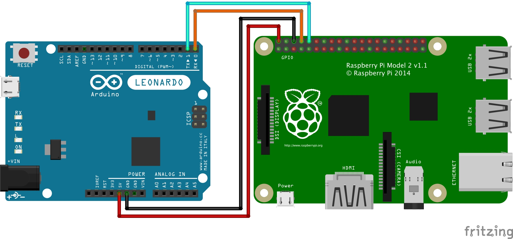

# Arduino USB-to-Serial Converter
Need a console connection to your Raspberry Pi and don't have a monitor or keyboard at hand? Here's how to build a simple USB to Serial converter with an Arduino. This was tested with an Arduino Leonardo. NO WARRANTY, USE WITH CARE.

## Wiring



**Warning:** The Raspberry Pi is powered over the Arduino's 5V pin. Don't connect your RPi to USB.

## Upload the sketch
Use the Arduino IDE to upload the [sketch](usbtoserial.ino) to the arduino.

## Open a serial connection
Use **screen** to connect to the serial port. The Arduino IDE shows to which port the device is connected.

```sh
$ screen /dev/<DEVICE> 115200
```
